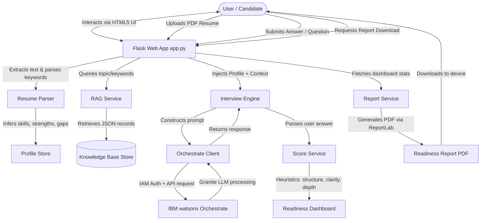

# 🚀 IBM watsonx Orchestrate AI Interview Trainer

An advanced, full-stack AI-powered mock interview preparation agent designed to help candidates prepare for technical, HR, behavioral, and system design interviews. The project integrates **IBM watsonx Orchestrate** and **IBM Granite LLMs** with local **Retrieval-Augmented Generation (RAG)**, resume parsing, and diagnostic readiness report generation.

---

## 🏗️ System Architecture

The following diagram illustrates how the frontend, Flask server, local RAG knowledge base, and IBM watsonx Orchestrate endpoints coordinate to provide real-time interactive interview prep:



---

## 🌟 Key Features

* **💬 Interactive AI Mock Interview Coaching**: Provides context-aware, step-by-step coaching simulating real-world interviewer behavior. Powered by the high-performance IBM Granite model.
* **📄 Automated PDF Resume Parsing**: Automatically extracts technical skills, identifies professional strengths, and provides a target role gap analysis from uploaded PDFs.
* **📚 Local Retrieval-Augmented Generation (RAG)**: Dynamically injects relevant domain-specific questions, reference answers, and industry concepts into the LLM context from a JSON knowledge base.
* **📊 Heuristic Scoring & Evaluation**: Automatically evaluates user responses for **Clarity**, **Structural Flow** (e.g., STAR framework usage), **Confidence indicators**, and **Technical Depth**.
* **📝 Downloadable Readiness Reports**: Exports your personalized scores, target role summary, key strengths, weaknesses, and recommended topics as a PDF report.
* **🌓 Modern Responsive UI**: Includes a responsive interface built with Bootstrap 5 featuring full system dark/light theme switching.

---

## 📂 Project Structure

```text
IBM Interview Agent/
│
├── data/
│   └── knowledge_base/
│       └── interview_basics.json   # JSON-based Q&A documents for RAG matching
│
├── services/
│   ├── __init__.py
│   ├── agent_config.py             # System prompts & instruction configurations
│   ├── interview_engine.py         # Main conversational logic & fallback engines
│   ├── orchestrate_client.py       # IAM authentication & watsonx Orchestrate API client
│   ├── profile_store.py            # Local session-level persistence for candidate profiles
│   ├── rag_service.py              # Term-frequency match scorer for RAG
│   ├── report_service.py           # ReportLab PDF compiler
│   ├── resume_parser.py            # PyPDF2 text extraction & keyword parser
│   └── score_service.py            # Heuristic response evaluation algorithm
│
├── static/
│   ├── css/
│   │   └── style.css               # Modern custom styling (Dark/Light mode)
│   └── js/
│       └── app.js                  # Frontend state machine & interface handlers
│
├── templates/
│   ├── base.html                   # HTML Skeleton
│   └── index.html                  # Main application Dashboard & Chat HUD
│
├── .env.example                    # Sample configuration variables
├── .gitignore                      # Git configuration to ignore virtual environments & credentials
├── app.py                          # Flask routing & endpoint controller
├── ibm-credentials.env             # Local IBM Cloud credentials configuration
└── requirements.txt                # List of system package requirements
```

---

## 🔧 Prerequisites & Installation

### 1. Clone & Set Up Directory
Ensure you have Python 3.9+ installed on your system.

```bash
# Clone the repository
git clone https://github.com/MokshFF/Interview-Trainer-Agent-.git
cd "Interview-Trainer-Agent-"
```

### 2. Configure Virtual Environment
```bash
# Create virtual environment
python -m venv .venv

# Activate it (Windows PowerShell)
.venv\Scripts\Activate.ps1

# Activate it (Mac/Linux)
source .venv/bin/activate
```

### 3. Install Dependencies
```bash
pip install -r requirements.txt
```

---

## ⚙️ Environment Variables Setup

Create a `.env` file in the root directory (or update `ibm-credentials.env`).

```ini
# Server Config
PORT=5000
FLASK_DEBUG=true
FLASK_SECRET_KEY=generate-a-secure-random-key-here

# IBM watsonx Orchestrate API Connection
ORCHESTRATE_URL=https://api.ibm.com/watson/orchestrate
ORCHESTRATE_APIKEY=your_ibm_cloud_api_key_here
ORCHESTRATE_AUTH_TYPE=iam

# (Optional) Direct Agent Mapping
# If left blank, the application automatically queries and binds to the active 'AskOrchestrate' agent endpoint.
ORCHESTRATE_AGENT_ID=your_agent_id_here
ORCHESTRATE_INVOKE_PATH=v1/orchestrate/your_agent_id_here/chat/completions

# Coach Customizations
AGENT_INTERVIEW_STYLE="balanced and professional"
AGENT_TONE="supportive, clear, and direct"
AGENT_DIFFICULTY="medium"
AGENT_COMPANY_FOCUS="adaptable to the target company"
```

---

## 📚 Customizing the RAG Knowledge Base

The trainer leverages a local RAG document library in `data/knowledge_base/`. You can inject customized questions, expectations, and tags.

Add a new JSON file (e.g. `data/knowledge_base/custom.json`) or append objects in `interview_basics.json` using this format:

```json
[
  {
    "topic": "system_design",
    "question": "What is the CAP Theorem?",
    "answer": "CAP theorem states a distributed system can only guarantee two of three properties at once: Consistency, Availability, and Partition Tolerance.",
    "tags": [
      "distributed systems",
      "architecture",
      "interview"
    ]
  }
]
```

When a user mentions terms like "CAP Theorem", "distributed systems", or "architecture" during preparation, the `RAGService` retrieves this block, feeds it directly to **IBM Granite**, and ensures the AI interviewer provides highly grounded feedback matching your company guidelines.

---

## 🚀 Running the App

Run the application locally:
```bash
python app.py
```
Open **`http://localhost:5000`** in your browser.

1. **Step 1**: Upload a PDF resume. Review the extracted skills, strengths, and missing topics dynamically loaded on the screen.
2. **Step 2**: Select a target role, company, and experience level.
3. **Step 3**: Start the mock interview by typing `"Hi"` or choosing a sample question.
4. **Step 4**: Enter your answers. Check the evaluation breakdown (clarity, structure, technical score) and read the real-time recommendations.
5. **Step 5**: Click **Download PDF Report** to export your progress chart.

---

## 🔒 Security & Data Privacy

* **Credentials**: IBM Cloud credentials are loaded safely from environment files and are never committed to Git.
* **Ignore Lists**: Local credential files (`ibm-credentials.env`, `.env`) and python virtual environments (`.venv/`) are configured in `.gitignore` to prevent leakage.
* **Data Persistence**: Active candidate profiles and session history are stored locally in the `instance/` folder and cleared automatically upon restarting/ending a session.
